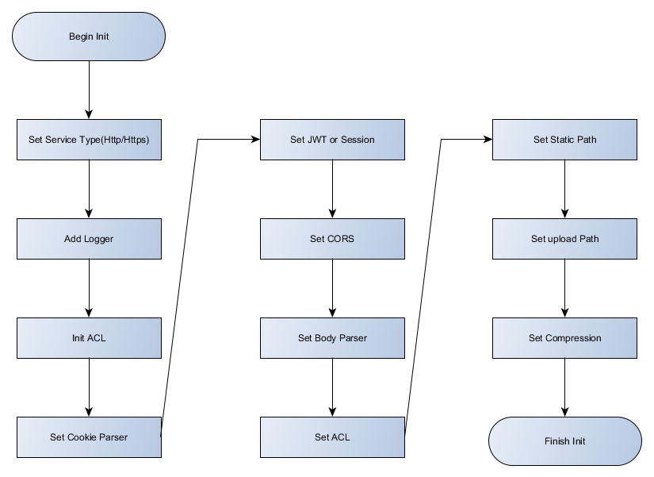
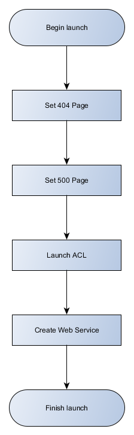
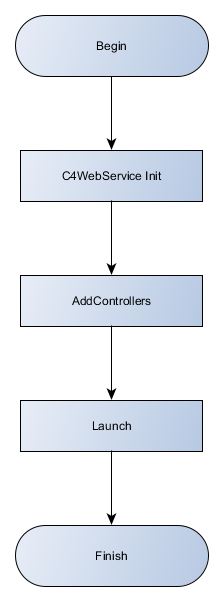
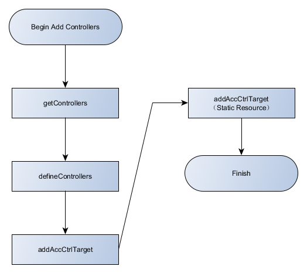

<h1>C4WebService</h1>

<h2>模块介绍</h2>

C4WebService是基于Express进行二次封装的WebService类，支持：

* http和https协议；
* 集成ACL（C4AccessControl）;
* 集成JWT（C4JWT）；
* 支持Cookie；
* 支持Session；
* 支持CORS（跨域支持）；
* 支持raw、urlencoded、text、json、xml格式Body；
* 支持静态路径；
* 支持gzip压缩；

<h2>初始化过程</h2>



<h2>启动过程</h2>



<h2>调用过程</h2>



<h2>加载Controllers过程</h2>




<h3>类s</h3>

* C4WebServive

  * 说明：C4WebService类，提供Web Service功能
  * 路径：./src/C4WebService.ts
  * 成员变量：

    * m_Name，服务名；
    * m_Type，协议类型Http或Https；
    * m_App，Express实例；
    * m_bInit，初始化标识；
    * m_DefaultBodyParser，默认Body解析器，没啥用；
    * m_StaticPath，静态文件路径；
    * m_UploadPath，上传文件路径；
    * m_CORS，跨域支持；
    * m_Host，监听的host名；
    * m_Port，监听的Port；
    * m_Domain，域名；
    * m_Logger，日志对象；
    * m_Http，Http对象；
    * m_CertConfig，https配置；
    * m_JWT，JWT对象；
    * m_ACL，C4AccessControl；

  * 成员方法：

    * init

    ```
    /**
     * 初始化
     * @param config WebServiceConfig
     */
    async init(config : WebServiceConfig)
    ```

    <hr>

    * getApp

    ```
    /**
     * 获取Express对象
     */
    getApp()
    ```

    <hr>

    * launch

    ```
    /**
     * 启动
     */
    async launch()
    ```

    <hr>

    * stop

    ```
    /**
     * 停止
     */
    async stop()
    ```

    <hr>

    * reset

    ```
    /**
     * 重启
     */
    async reset()
    ```

    <hr>

    * addControllers

    ```
    /**
     * 添加Controllers
     * @param controllers controller对象或加载路径
     */
    async addControllers(controllers : Array<any>) : Promise<any>;
    async addControllers(controllerPaths :  string[]) : Promise<any>;
    async addControllers(arg: Array<any | string>)
    ```

    <hr>
